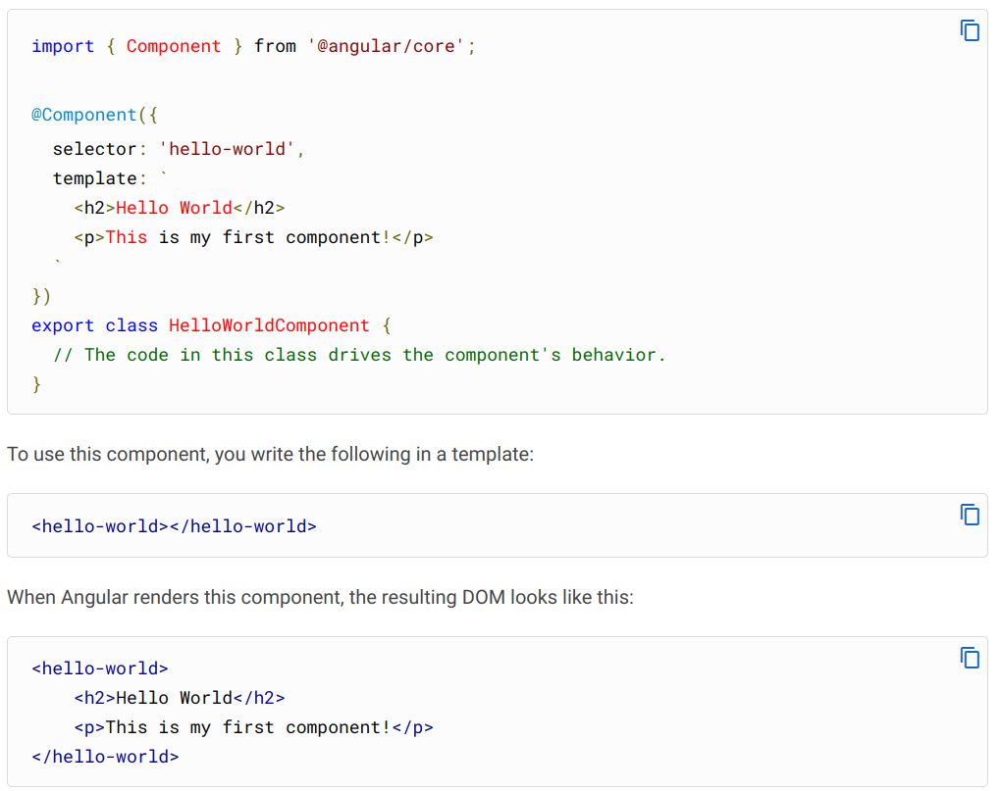

# Component

Задаются:
1. селектор компонента
2. шаблон
3. стили

Элементы html-файла с тегами селектора компонента становятся экземплярами класса 

`<selector> `   
`html template`   
`</selector>`   

