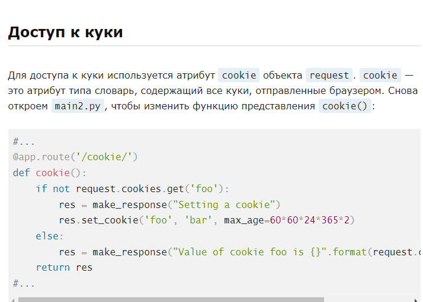
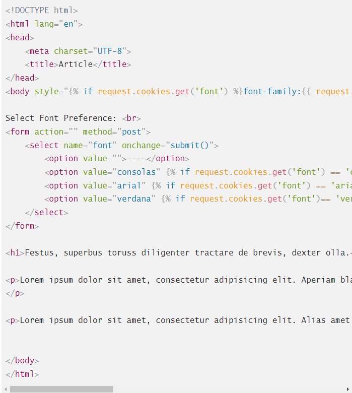

## 1) Синтаксис
> set_cookie(key, value="", max_age=None)  

Примечание:  
key — обязательный аргумент, это название куки.  
value — данные, которые нужно сохранить в куки. По умолчанию это пустая строка.  
max_age — это срок действия куки в секундах. Если не указать срок, срок истечет при закрытии браузера пользователем.  

Чтобы удалить cookie, необходимо выставить аргумент max_age=0  

Пример:  
  
  

