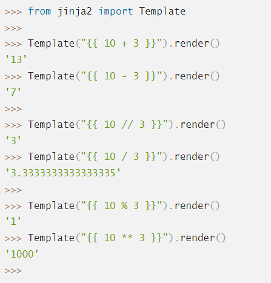

# Шаблоны
1) from flask import render_template
2) Используется шаблонизатор jinja2
3) Шаблонизатор заменяет в файле динамические компоненты на статические
    - {{ component }}
4) return render_template("file", **kwargs) // kwargs = {component: value, ... }

# Основы шаблонизатора jinja
1) Арифметические операции  
`
> from jinja2 import Template
> 
> Template("{{ 10 + 3 }}").render()  
> '13'  
> Template("{{ 10 - 3 }}").render()  
> '7'  
> Template("{{ 10 // 3 }}").render()  
> '3'  
> Template("{{ 10 / 3 }}").render()  
> '3.3333333333333335'  
> Template("{{ 10 % 3 }}").render()  
> '1'  
> Template("{{ 10 ** 3 }}").render()  
> '1000' `  

