# Шаблоны
1) from flask import render_template
2) Используется шаблонизатор jinja2
3) Шаблонизатор заменяет в файле динамические компоненты на статические
    - {{ component }}
4) return render_template("file", **kwargs) // kwargs = {component: value, ... }

# Основы шаблонизатора jinja
1) Арифметические операции
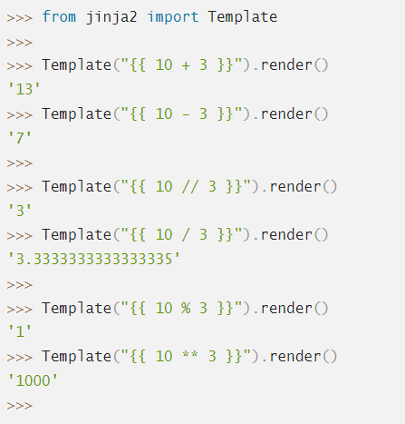

2) Типы данных
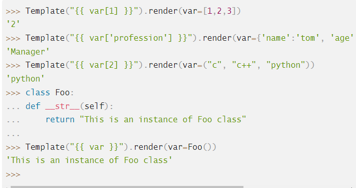

3) Атрибуты и методы
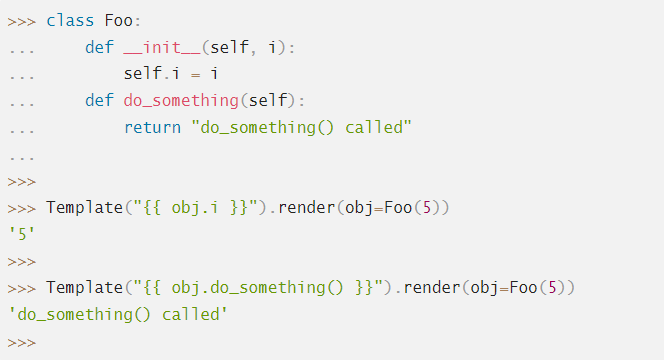

4) Объявление переменных
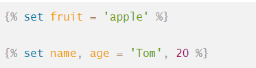

5) Инструкция if
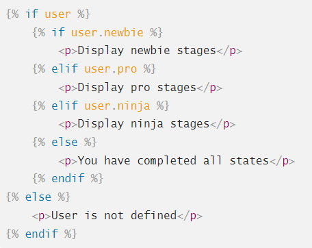

6) Инструкция for
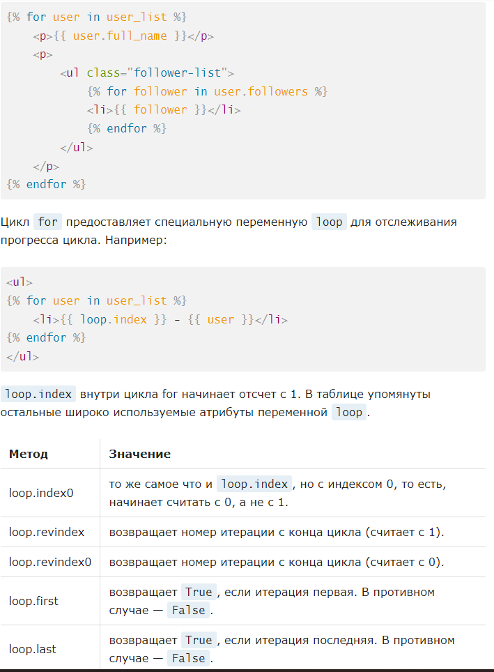

7) Фильтры
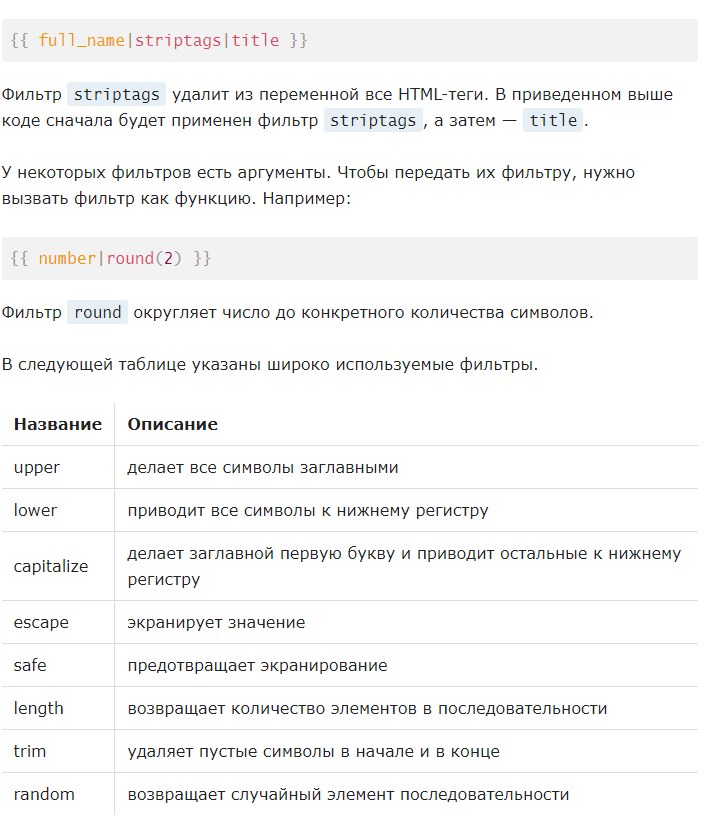

8) Макросы
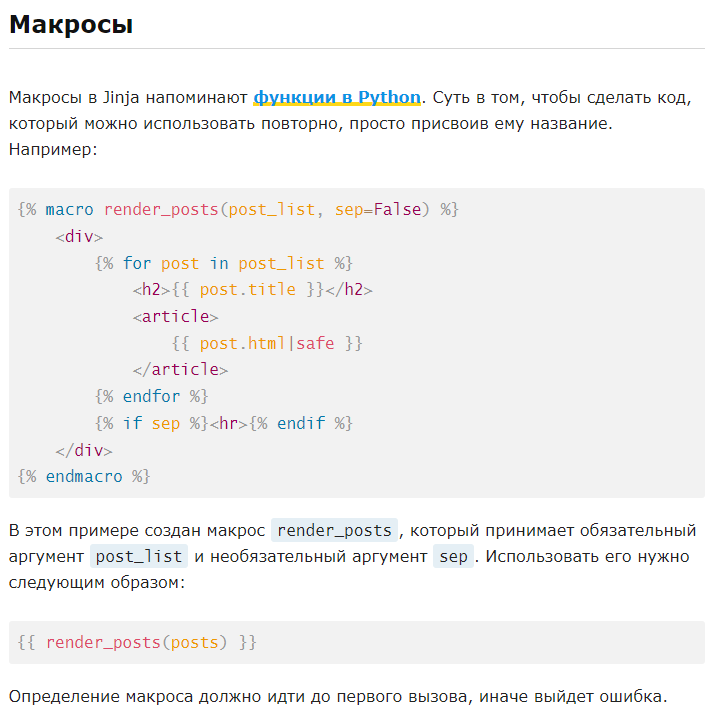
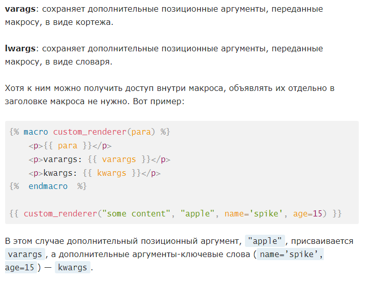

9) Вложенные шаблоны
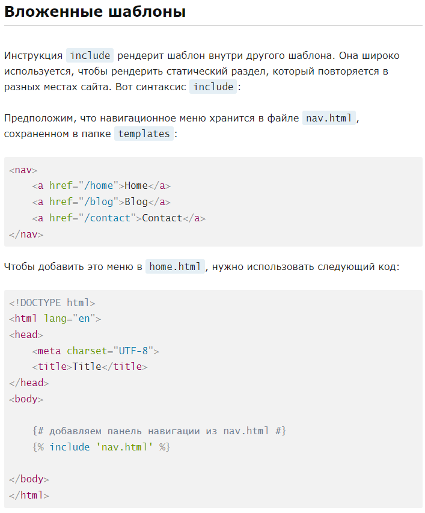

10) Наследование шаблонов
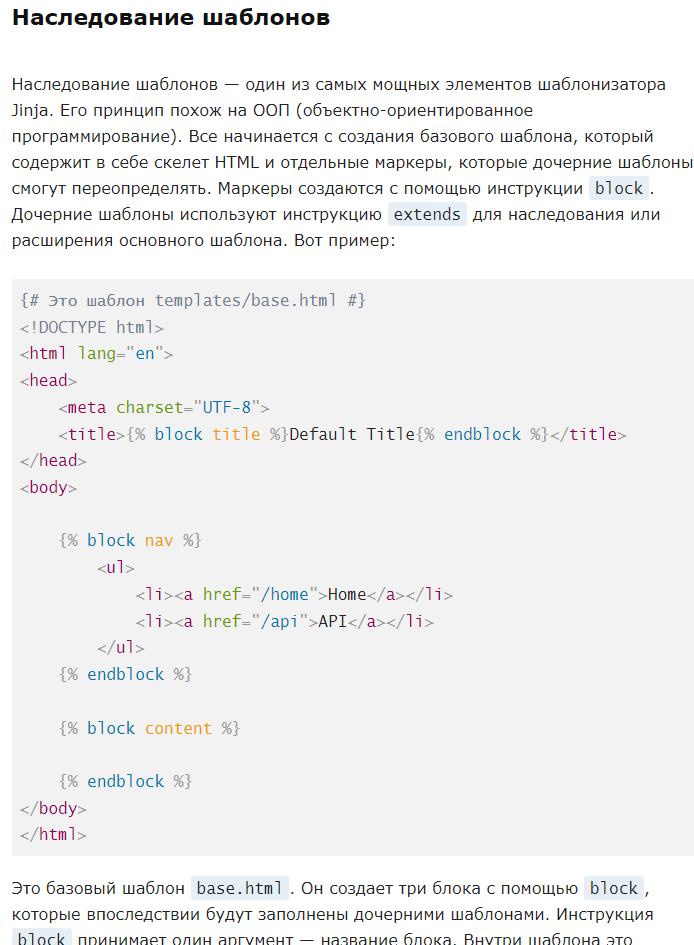
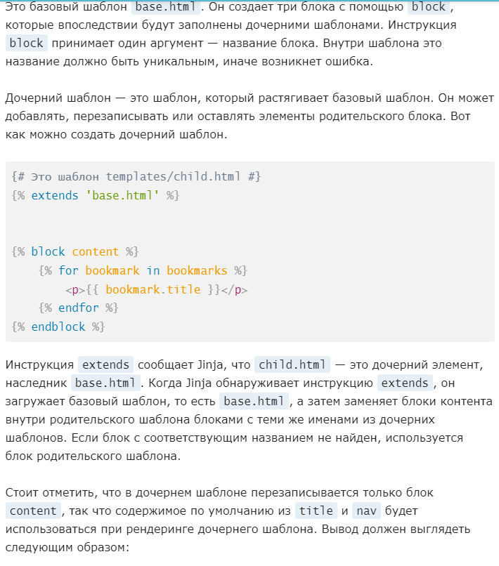

