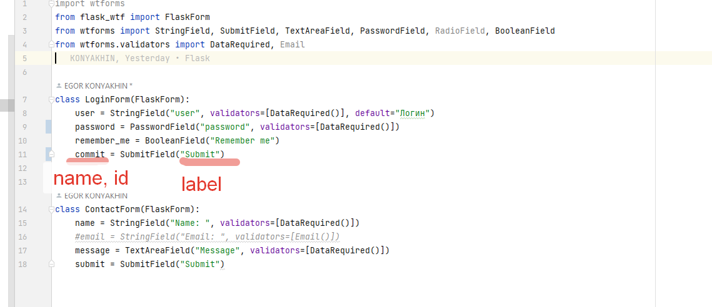
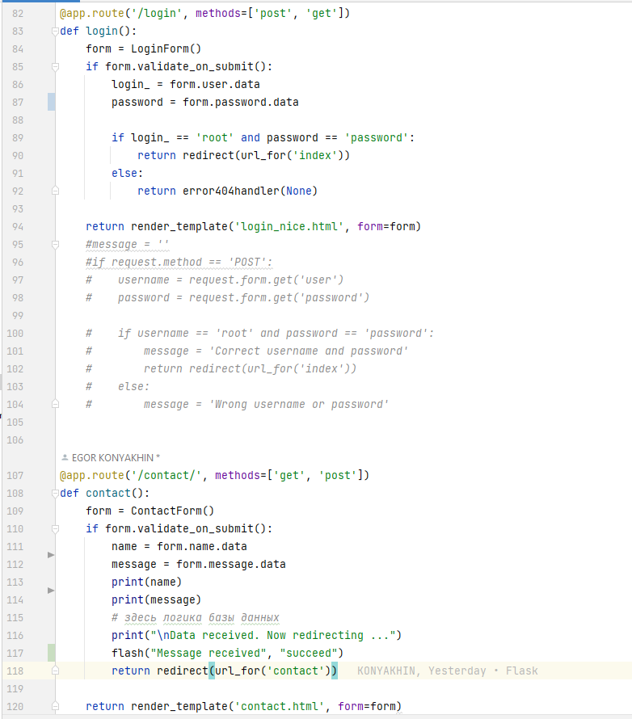
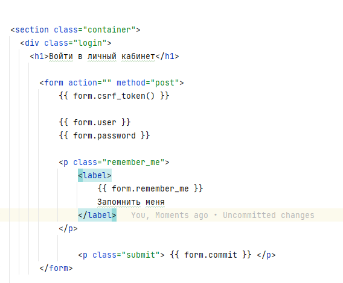
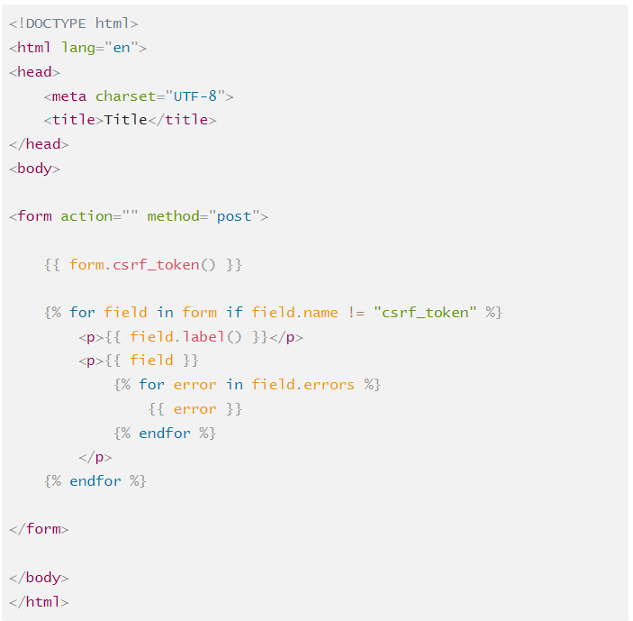

## 1. Создание классов форм
> `from flask_wtf import FlaskForm`  
>
> `from wtforms import StringField, SubmitField, TextAreaField, PasswordField, RadioField, BooleanField`  
>
> `from wtforms.validators import DataRequired, Email`  

## 2. Работа с формами

## 3. Шаблоны с формами

