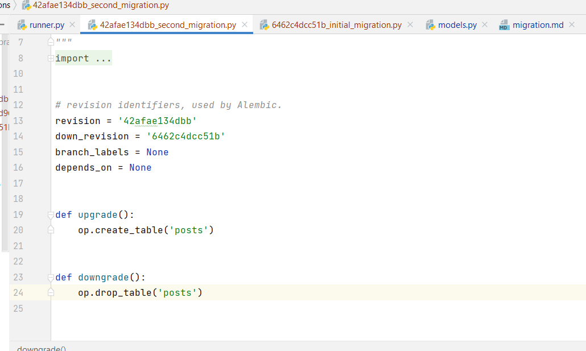
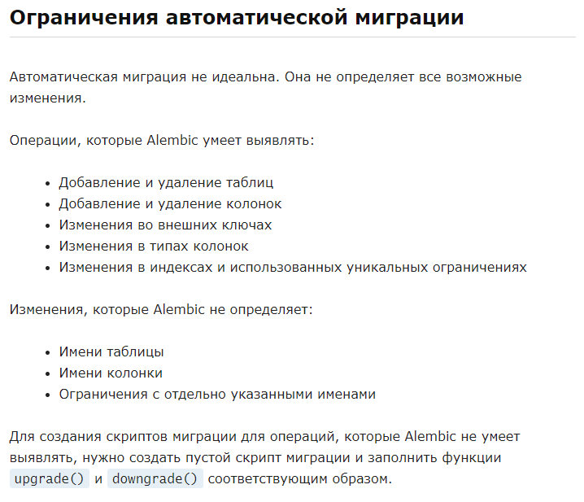

# Manual migration

## 1) Create migration folder 
> python -m flask -A .\runner.py db init
> python -m flask -A <your_app.py> [commands]

## 2) Create migrations
>  python -m flask -A .\runner.py db revision -m "Initial migration"  

## 3) Show version of current migration
>  python -m flask -A .\runner.py db current

## 4) Upgrade database (do migration)
>  python -m flask -A .\runner.py db upgrade

## 5) Downgrade database
>  python -m flask -A .\runner.py db downgrade  

## 6) Edit migration

# Automigration
- > python -m flask -A .\runner.py db migrate -m "Message"  

- > python -m flask -A .\runner.py db upgrade  

## Ограничения автомиграции
